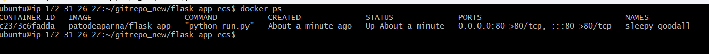
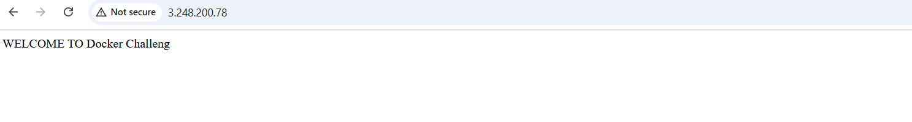
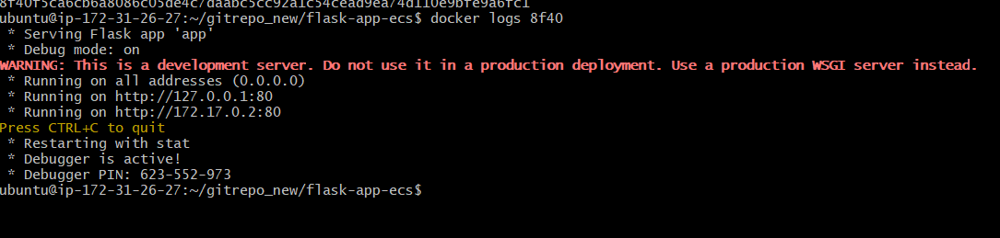

## Task 2: Create a Dockerfile for a Sample Project
### 1. Select or Create a Sample Application:

For this task, we will create a simple Python Flask application that serves a basic web page displaying "Hello, Docker!".

#### Sample Python Flask App (`app.py`):

    
    python
    from flask import Flask

    app = Flask(__name__)

    @app.route('/')
    def home():
        return "Hello, Docker!"

    if __name__ == "__main__":
        app.run(host='0.0.0.0', port=80)
    
### 2. Write a Dockerfile:

Create a `Dockerfile` that defines how to build an image for your application. Below is the `Dockerfile` for the Flask app:

#### `Dockerfile`:

    
    dockerfile
    # Use an official Python runtime as a parent image
    FROM python:3.9-slim

    # Set the working directory in the container
    WORKDIR /app

    # Copy the current directory contents into the container at /app
    COPY . /app

    # Install any needed dependencies specified in requirements.txt
    RUN pip install flask

    # Make port 80 available to the world outside this container
    EXPOSE 80

    # Define environment variable
    ENV NAME World

    # Run app.py when the container launches
    CMD ["python", "app.py"]

### 3. Build and Verify Your Docker Image:

#### Step 1: Build the Docker Image

Run the following command to build the Docker image:

    
    sh
    docker build -t <your-username>/sample-app:latest .
    

#### Step 2: Run the Container

Launch the container to verify it works as expected:

    sh
    docker run -d -p 8080:80 <your-username>/sample-app:latest
    

#### Step 3: Verify the Running Container

Check if the container is running:

    sh
    docker ps
    

#### Step 4: Access the Application

#### Step 5: Check Container Logs

Retrieve logs to verify proper execution:

    
    docker logs <container_id>
    
