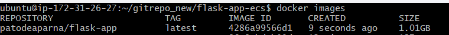
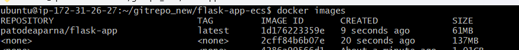

## Task 4: Implementing Multi-Stage Docker Builds

### 1. Introduction to Multi-Stage Builds

A **multi-stage build** in Docker allows developers to optimize the size and security of container images by using multiple stages to build and package an application. This approach eliminates unnecessary dependencies from the final image, resulting in a **smaller, faster, and more secure** deployment.

### 2. Why Use Multi-Stage Builds?
- **Reduces Image Size**: Only the necessary files are copied to the final image, making it lightweight.
-**Improves Security**: Removes unneeded build tools to reduce the attack surface.
-**Enhances Build Performance**: Uses Docker's layer caching to accelerate builds.
-**Simplifies Dependency Management**: Keeps dependencies between build and runtime distinct.
-**Allows Using Different Base Images**: Makes it possible to run with a minimum image and create with a full one.
-**Optimizes CI/CD Pipelines**: Creates pictures that are cleaner and suitable for distribution.
-**Reduces Build Complexity**: Combines the runtime and construction phases into a single Dockerfile.

### 3. Modify the Existing Dockerfile

Below is an example of implementing a **multi-stage build** in a Flask application.

#### `Dockerfile` (Before Multi-Stage Build):
   
    # Use an official Python runtime as a parent image
    FROM python:3.9

    # Set the working directory
    WORKDIR /app

    # Copy the application files
    COPY . /app

    # Install dependencies
    RUN pip install flask
    # Expose port 5000
    EXPOSE 5000

    # Run the application
    CMD ["python", "app.py"]

#### `Dockerfile` (After Multi-Stage Build):

    # Stage 1: Builder Stage - Install Dependencies
    FROM python:3.9 AS builder
    WORKDIR /app
    COPY requirements.txt .
    RUN pip install --no-cache-dir -r requirements.txt

    # Stage 2: Minimal Runtime Stage
    FROM python:3.9-slim
    WORKDIR /app
    COPY --from=builder /usr/local/lib/python3.9/site-packages /usr/local/lib/python3.9/site-packages
    COPY . /app

    # Expose port 5000
    EXPOSE 5000

    # Run the application
    CMD ["python", "app.py"]

### 4. Compare Image Sizes

To assess the impact of multi-stage builds, compare the image sizes before and after implementation.

#### Step 1: Build the Image Before Multi-Stage

    docker build -t my-app-before .
    
Check the image size:

    
    docker images
    

#### Step 2: Build the Image After Multi-Stage

    docker build -t my-app-after .
    

Check the optimized image size:

    docker images

### 5. Key Benefits of Multi-Stage Builds

- **Minimizes Disk Usage**: Only includes necessary files in the final image.
- **Optimized Deployment**: Reduces application startup time and deployment time.
- **Security Hardening**: Excludes sensitive development tools from the final image.
- **Better Maintainability**: Cleaner separation between the build environment and production environment.

### 6. Best Practices for Multi-Stage Builds

- **Use lightweight base images** to minimize the final image size.
- **Avoid copying unnecessary files** from the build stage to the final stage.
- **Utilize caching** by structuring Dockerfile layers optimally.
- **Use specific dependency versions** in `requirements.txt` to prevent unexpected behavior.
- **Validate image contents** by running tests before deployment.