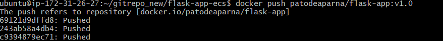

## Task 5: Manage Your Image with Docker Hub

### 1. Tag Your Image

#### What is Image Tagging?

The process of giving a Docker image a human-readable tag is known as image tagging. Using tags makes it easier to distinguish between various iterations of the same image.

#### How to Tag an Image

Before pushing an image to Docker Hub, it needs to be appropriately tagged. The format for tagging an image is:


    docker tag <image-id> <your-username>/sample-app:v1.0


#### Example:

Assume you have built an image named `sample-app:latest`. To tag it for Docker Hub:

    
    docker tag sample-app:latest <your-username>/sample-app:v1.0
    

This creates an alias `<your-username>/sample-app:v1.0` for the existing image.


#### Best Practices for Tagging:

- Always use **semantic versioning** (e.g., `v1.0.1`, `v1.1.0`).
- Avoid using **latest** in production, as it can lead to unexpected version mismatches.
- Use **descriptive tags** like `stable`, `beta`, or `dev` for different environments.

---

### 2. Push Your Image to Docker Hub

#### Why Push an Image?

Pushing an image to Docker Hub allows it to be stored in the cloud, making it accessible from any system. This is useful for **team collaboration, deployment automation, and container orchestration**.

#### Step 1: Log in to Docker Hub

If you haven't logged in already, authenticate with Docker Hub using:

    
    docker login


You'll be prompted to enter your **Docker Hub username** and **password**.

#### Step 2: Push the Tagged Image

Once authenticated, push your image to Docker Hub:

    
    docker push <your-username>/sample-app:v1.0
    

This command uploads the image to your Docker Hub repository.

#### Example:

A developer working on an application pushes the image to Docker Hub for easy access across multiple servers:

    
    docker push myusername/sample-app:v1.0
    




#### Why Pull an Image?

Pulling an image ensures that the uploaded image is accessible and can be downloaded onto any machine. It’s a great way to **validate the push process and deploy the image elsewhere**.

#### How to Pull an Image

To download the image from Docker Hub:

```sh
docker pull <your-username>/sample-app:v1.0
```

This fetches the latest version of the specified image and stores it locally.

#### Example:

A new developer joins a project and needs to run the latest containerized application. Instead of setting up everything manually, they simply pull the latest image:

    
    docker pull myusername/sample-app:v1.0


Now, they can immediately run the container without additional configuration.

#### Best Practices for Pulling:

- Always **verify the image source** before pulling.
- Use **specific versions** instead of `latest` to avoid unexpected updates.
- Scan images for **security vulnerabilities** after pulling.

---

### 4. Verify the Process

After pulling the image, verify that it's available by running:

    docker images


You should see the image `<your-username>/sample-app:v1.0` in the list.


#### Example Output:

```sh
REPOSITORY                 TAG        IMAGE ID       CREATED        SIZE
myusername/sample-app      v1.0       abc12345       5 minutes ago  50MB
```

This confirms that the image is successfully pushed and accessible from any machine.

#### Additional Verification Steps:

- Run the image using:
    
        docker run -d -p 5000:5000 <your-username>/sample-app:v1.0
    
- Check running containers:
  
        docker ps
  
- Stop and remove the container if needed:
    
        docker stop <container_id>
        docker rm <container_id>
    

    