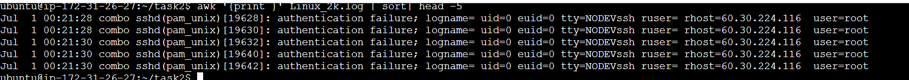
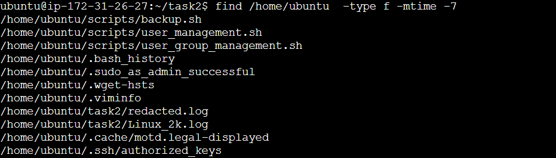

## Bonus Tasks (Optional)
### Overview
These tasks focus on log file analysis and file management using Linux commands. You will:

1. Find the top 5 most common log messages in Linux_2k.log using awk and sort.
2. Use find to list all files modified in the last 7 days.
3. Write a script to extract and display only ERROR and WARNING logs from Linux_2k.log.

### Steps 
1. Find the top 5 most common log messages in Linux_2k.log using awk and sort.

```
awk '{print }' Linux_2k.log | sort| head -5 
```




2. Find All Files Modified in the Last 7 Days

``` 
find /path/to/directory -type f -mtime -7
```




- ***`-type f`*** → Searches for files (not directories).
- ***`-mtime -7`*** → Finds files modified in the last 7 days.

3. Extract and Display ERROR & WARNING Logs

```
grep -i -e "ERROR" -e "WARNING" Linux_2k.log
```


