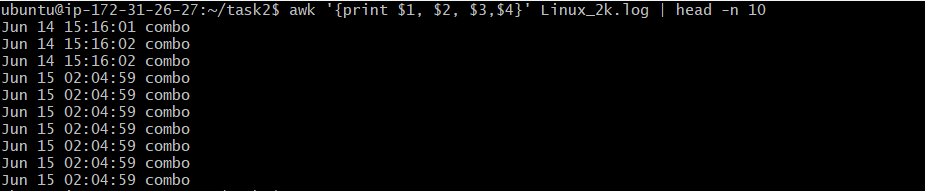
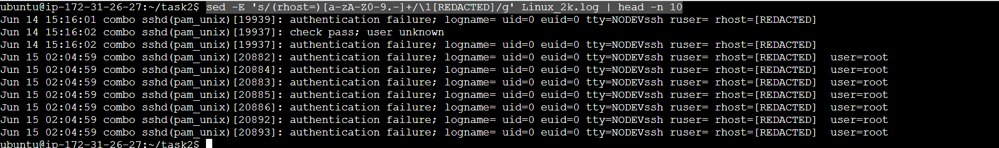
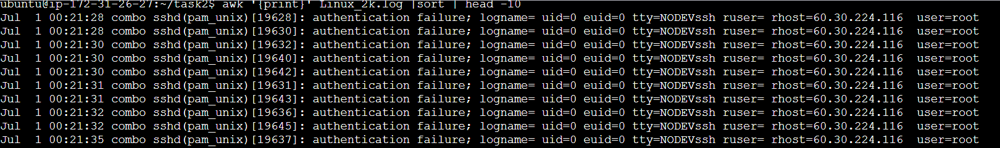
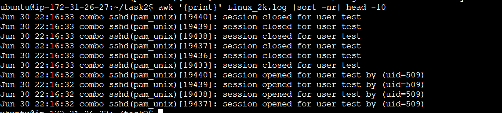

## Log File Analysis with AWK, Grep & Sed

## Overview
This assignment involves analyzing logs with grep, awk, and sed to extract insights, filter relevant logs, and safeguard sensitive data. You will also categorize and count the most common log entries.

## Steps
1. Download the log file.

    ```
    wget https://raw.githubusercontent.com/logpai/loghub/master/Linux/Linux_2k.log -O Linux_2k.log
    ```

2. Find all occurrences of the word "error" using `grep` command.

    ```
    grep -i "error" Linux_2k.log > error_logs.txt
    ```

    `-i` for case-insensitive

    

3. Extract timestamps and log levels using `awk`.

    ```
    awk '{print $1, $2, $3, $6}' Linux_2k.log > timestamps_logs.txt
    ```

    

4. Mask all IP addresses in the log file using `sed`.

    ```
    sed -E 's/(rhost=)[a-zA-Z0-9.-]+/\1[REDACTED]/g' Linux_2k.log > masked_logs.txt
    ```

    


5. Find the most frequent log entry using `awk`, `sort`, and `uniq`.

    ```
    awk '{print $6}' Linux_2k.log | sort | uniq -c | sort -nr | head -10 > frequent_logs.txt
    ```

    

    


## Notes
- **`grep`** is used for filtering logs based on keywords.
- **`awk`** extracts specific fields from logs for better readability.
- **`sed`** helps secure logs by replacing sensitive IP addresses.
- **`sort`** and uniq are used to analyze the most frequent log events.
- Ensure you have the required Linux utilities installed before running the commands.

## Conclusion
This task enhances log analysis skills using Linux commands, helping in troubleshooting, security auditing, and system monitoring.