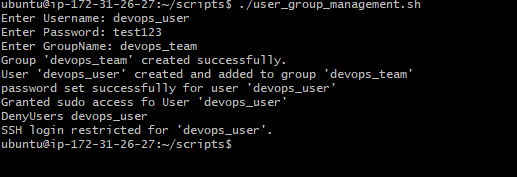

## User and Group Management
## Overview
This script automates user and group management in Linux by:

- Creating a user (devops_user) and assigning them to a group (devops_team).
- Setting a password and granting sudo privileges.
- Restricting SSH login for security.

## Bash Script

```
usergroup_management() {
        read -p "Enter Username: " username
        read -p "Enter Password: " password
        read -p "Enter GroupName: " groupname

        # Step 1: Create a group if it doesn't exist
        if ! grep -q "^$groupname:" /etc/group; then
                sudo groupadd $groupname
                echo "Group '$groupname' created successfully."
        else
                echo "Group '$groupname' already exists."
        fi

        # Step 2 : Create user and add to the group
        if ! grep -q "^$username" /etc/passwd; then
                sudo useradd -m -g $groupname -s /bin/bash $username
                echo "User '$username' created and added to group '$groupname' "
        else
                echo "Username '$username' already exists"
                exit 1

        fi

        echo -e "$username:$password" | sudo chpasswd
        echo "password set successfully for user '$username' "

        # step 4: Grant sudo access
        sudo usermod -aG sudo $username
        echo "Granted sudo access fo User '$username' "

        # Step 5: Restrict SSH login
        SSH_CONFIG="/etc/ssh/sshd_config"
        if ! grep -q "^DenyUsers $username" $SSH_CONFIG; then
                echo "DenyUsers $username" | sudo tee -a $SSH_CONFIG
                sudo systemctl restart sshd
                echo "SSH login restricted for '$username'."
        else
                echo "SSH restriction for '$username' already exists."
        fi

}

usergroup_management

```

### Bash Script Breakdown
The script is a Bash function that manages user and group creation on a Linux system. It follows these steps:

- Prompts the user for input (username, password, group name).
- Checks if the group exists; if not, it creates one.
- Checks if the user exists; if not, it creates one and     assigns them to the specified group.
- Sets the user's password.
- Grants the user sudo access.
- Restricts SSH access for the user.

### How To Use
1. #### Make the script executable

        ```
        chmod +x user_group_management.sh
        ```
2. #### Run the script

        ```
        sudo ./user_group_management.sh
        ```

3. #### Verify the results

- Check if the user exists

        ```
        id devios_user
        ```

- Verify the group

        ```
        groups devops_team
        ```

- Test SSH restriction

        ```
        ssh devops_user@your-server-ip
        ```

### OUTPUT



### Conclusion
This Bash script automates user and group management by establishing users, assigning them to groups, granting sudo access, and restricting SSH login to ensure security. It ensures correct system administration while efficiently addressing faults and existing entries.