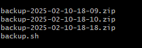
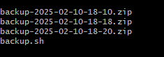

## Automated Backup & Recovery using Cron

## Overview
This script uses a rotation method to automatically backup a specific directory and save only the last three backups.

## Functionality
- The given directory is copied to the newly generated backup folder.
- If there are more than three backups, the oldest ones are removed, leaving only the current three.

## Usage
### Running the shell script
To run the script use the following command:
```
$ ./backup_with_rotation.sh <source> <destination>
```
Example
```
$ ./backup_with_rotation.sh /home/ubuntu/scripts /home/ubuntu/backups
```

### Shell Script
1. #### Defining the variable

```
src=$1
dest=$2
timestamp=$(date '+%Y-%m-%d-%H-%M')
```

- src=$1 -> specifies the source directory for backup.
- dest=$2 -> specifies the location where backups will be kept.

- timestamp=$(date '+%Y-%m-%d-%H-%M') -> Creates a timestamp (YYYY-MM-DD-HH-MM) to uniquely identify the backup file.
2. #### Creating the backup 

```
zip -r $dest/backup-$timestamp.zip $src
```
- zip -r → Recursively compresses the src directory.
- The output file is stored in dest with a name in the format backup-YYYY-MM-DD-HH-MM.zip.

3. #### Removing Old Backups (Backup Rotation)
```
for file in `ls -v $dest | grep -e ".zip" | head -n -3`;
do
        sudo rm "$dest/$file"
done
```
- ls -v $dest → Lists all files in dest in natural version order (sorting numerically).
- grep -e ".zip" → Filters out only .zip backup files.
- head -n -3 → Selects all but the last 3 backup files (i.e., the oldest backups).
- The for loop iterates over these old backup files and deletes them using sudo rm "$dest/$file".
4. #### Displaying Completion Message

```
echo "Backup Completed"
```
Prints a message indicating that the backup has been completed successfully.

### OUTPUT




## Conclusion
This script automates directory backups by generating timestamped.zip files and provides efficient storage management by retaining only the last three backups. It ensures backup hygiene by removing older backups in a systematic manner.


