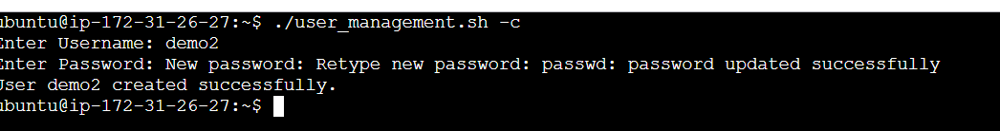
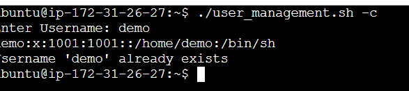

# User Account Creation

## Overview

This script creates a new user account in a Linux system via  shell scripting. It allows users to provide a username and password before creating an account, verifying that the username is available.

## To-Do
- Creates a new user account with the given username and password.
- Before proceeding, check to see if the username has already been taken.
- When the account is successfully created, it displays a success message.

## Usage
### Running the shell script
```
$ ./user_management.sh -c
```
or 
```
$ ./user_management.sh -c
```
```
user_create() {
        read -p "Enter Username: " username
        if grep -w "^$username" /etc/passwd; then
                echo "Username '$username' already exists"
                exit 1
        fi
        read -s -p "Enter Password: " password
        sudo useradd -m "$username"
        echo -e "$password\n$password" | sudo passwd "$username"
        echo -e "User $username created successfully."
}
```
### STEPS
1. The script will ask you to input a new username.
2. It will check to see if the username already exists.
3. If the username is not exist, it will ask you to enter your password.
4. The user account will be established once you enter your password.
5. A success message will be shown.

### OUTPUT


### Error Handling


## Conclusion
This script makes it easier to create user accounts while still providing minimal validation and user-friendly interactions.

