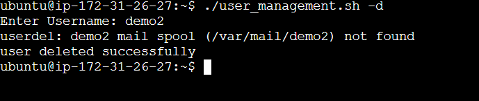
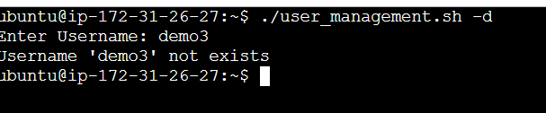

## User Account Deletion
### Overview
This script allows you to easily delete an existing user account from a Linux machine. It checks that the username exists before proceeding with the deletion and offers relevant feedback.

## To-Do
- Allows users to delete an account with a certain username.
- Checks to see if the username already exists before attempting to delete it.
- Upon successful deletion, a confirmation message is displayed.

## Usage
### Running the Script

To delete a user account, use the following command:

```
$ ./user_management.sh -d

```
or
```
$ ./user_management.sh -c
```

```
user_del() {
        read -p "Enter Username: " username
        if grep -q "^$username" /etc/passwd; then
                sudo userdel -r "$username"
                echo -e "user deleted successfully"
        else 
                echo "Username '$username' not exists"
                exit 1
        fi
}

        
if [[ "$1" == "-d" || "$1" == "--delete" ]]; then
    user_del
else 
    echo "Usage: $0 -d | --delete (delete) "
fi

```

### Steps
1. The script will request you to provide the username of the account you wish to delete.
2. It will determine if the username exists.
3. If the username is present, the account will be deleted.
4. Following the deletion, a confirmation message will be presented.

### OUTPUT


### Error Handling


## Conclusion
This script simplifies the process of deleting user accounts while providing the necessary checks to avoid problems.
