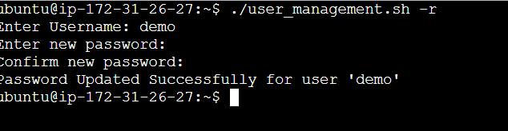
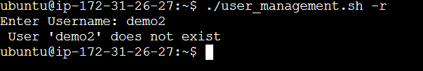

## User Password Reset
## Overview
This script makes it simple to reset a password for an existing user account on a Linux system. It checks for the existence of the username before proceeding with the password reset and provides necessary feedback.

## To-Do
- Allows users to reset the password for an existing account.
- Before attempting to reset the password, it checks to see if the username already exists.
- A success message is displayed after the password has been successfully reset.

## Usage
### Running the shell script

To reset a user password, use the following command:
```
$ ./user_management.sh -r
```
```
$ ./user_management.sh -reset
```
### Steps
1. The script will ask you to input the username for the account whose password needs to be reset.
2. It will determine if the username exists.
3. If the username already exists, it will ask for a new password.
4. The user's password will be reset once the new password is entered.
5. A success message will appear, confirming the password reset.
```
pass_reset() {
        read -p "Enter Username: " username
        if grep -q "^$username" /etc/passwd; then
            read -s -p "Enter new password: " password
            echo
            read -s -p "Confirm new password: " password_confirm
            echo

            if [[ "$password" != "$password_confirm" ]];
            then
                echo "Password do not match"
                exit 1
            fi

            echo -e "$username:$password" | sudo chpasswd

            echo -e "Password Updated Successfully for user '$username' "
        else
             echo " User '$username' does not exist"
        fi
}
if [[ "$1" == "-r" || "$1" == "--reset" ]];
then
        pass_reset
else
       echo "Usage: $0 -r | --reset (Password Reset)
fi 
```
### OUTPUT


### Error Handling


## Conclusion
This script makes it easier to reset a user password while also assuring proper validation and user-friendly interactions.