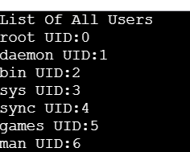

## List User Accounts
### Overview
This script lists all user accounts on a Linux system, along with their respective User IDs (UIDs). It provides a clean and structured output for simple reference.

## To-Do
- Lists all system users.
- Displays usernames and their corresponding UIDs

## Usage
### Running the shell script
```
$ ./user_management.sh -l
```
```
$ ./user_management.sh --list
```

```
users_list() {
        echo "List Of All Users"
        awk -F: '{print $1,"UID:" $3}' /etc/passwd
}
if [[ "$1" == "-l" || "$1" == "--list" ]];
then
        users_list
else
       echo "Usage: $0 -l | --list (list of users)
fi
```
## OUTPUT

## Conclusion 
This script allows you to easily display all user accounts on a system, making it handy for system administrators and user management chores.

